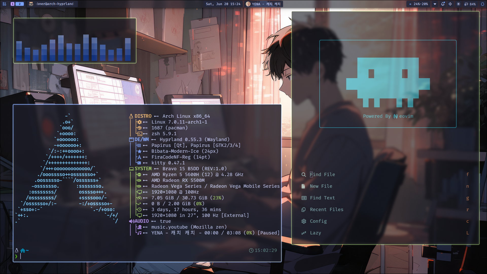

# Arch Hyprland Dotfiles

Personal Arch Linux dotfiles for a Hyprland desktop, managed with
[Homebase](https://github.com/gin31259461/homebase) configuration in a bare Git
repository. This repository is the sole source of Homebase's platform TOML;
Homebase does not ship or refresh a second copy.



This repository tracks the user-facing configuration needed to rebuild and
maintain the workstation: shell startup, desktop theming, Hyprland/Neovim
submodules, app settings, Homebase install groups, cleanup tasks, and setup
notes.

> [!NOTE]
> `$HOME` is the work tree and `~/.dotfiles/` is the Git directory. Use the
> `dot` alias from `.zshrc`, or pass `--git-dir` and `--work-tree` explicitly.

## What It Manages

- **Homebase platform config** in `.config/homebase/`, owned here and selected
  automatically for Arch and Manjaro hosts.
- **Package groups** for Hyprland, shell tools, desktop apps, theming, fonts,
  input methods, AMD GPU support, Docker, Razer/MSI hardware, and development
  tooling.
- **Desktop configuration** for Kitty, Ghostty, GTK, Qt, Kvantum, Vicinae,
  Quickshell, Noctalia, Cava, btop, Fastfetch, Swappy, Vesktop, Sunshine, and
  related app settings.
- **Graphical-session services** under `.config/systemd/user/`, with enablement
  and conditional startup repaired through Homebase.
- **Shell setup** for Zsh, Oh My Zsh, Powerlevel10k, fzf, `lsd`, and a `dot`
  helper alias for the bare repository.
- **Submodules** for `.config/hypr` and `.config/nvim`.
- **Agent configuration** under `.agents/skills` and `.codex/agents`.

## Requirements

- Arch Linux or Manjaro
- `git`, `rsync`, `base-devel`, `go`, `ca-certificates`, `lsd`, `zsh`, and
  `openssh` for initial bootstrap
- `~/.local/bin/hb`, installed from the Homebase bootstrap flow

The Homebase platform file defines `pacman` as the official package manager and
`yay` for AUR packages.

## Get Started

On a fresh Arch-family machine, install Homebase and bootstrap this dotfiles
repo:

```bash
url=https://raw.githubusercontent.com/gin31259461/homebase/main/bootstrap
curl -fsSL "$url/archlinux.sh" | \
  bash -s -- --repo gin31259461/dotfiles-arch
```

Bootstrap and install every configured package group:

```bash
url=https://raw.githubusercontent.com/gin31259461/homebase/main/bootstrap
curl -fsSL "$url/archlinux.sh" | \
  bash -s -- --repo gin31259461/dotfiles-arch --yes --install
```

Once `hb` is installed, bootstrap directly:

```bash
hb bootstrap
```

Install configured packages:

```bash
hb install --all
```

Repair graphical-session service enablement:

```bash
hb setup --hook desktop-session --yes
```

Review and run cleanup tasks:

```bash
hb cleanup
```

Sync tracked dotfiles:

```bash
hb sync -m "Update dotfiles"
```

For unattended runs, pass `--yes` with an explicit `--group`, `--task`, or
`--all` selection.

> [!IMPORTANT]
> `hb sync` stages every path configured in
> `.config/homebase/platforms/archlinux/sync.toml`, including deletions. Review
> the bare-repo status before syncing.

## Graphical Session Startup

UWSM starts Hyprland from `.zprofile` and exposes
`graphical-session.target`. Application startup is split by owner to avoid
duplicate processes:

| Owner | Managed applications |
| --- | --- |
| Package user units | Vicinae and hyprpolkitagent |
| Tracked user units | KeePassXC, desktop shells, tray apps, and Vesktop |
| System XDG autostart | NetworkManager applet, Blueman applet, and fcitx5 |
| Hyprland autostart | Rainbow border runtime effect only |

`hb setup --hook desktop-session --yes` reloads the systemd user manager and
reconciles the versioned inventory in
`.config/homebase/platforms/archlinux/desktop-session.toml`. Required units
must exist. When the graphical target is already active, Vicinae and
hyprpolkitagent also start immediately and must become active. From a TTY they
wait for the next graphical login; the tracked custom units are enable-only and
join the next graphical session.

Vicinae is the launcher, clipboard history, window switcher, file search, emoji
picker, and dmenu frontend. This repository no longer manages a Rofi package,
configuration, keybind, or Noctalia-to-Rasi theme conversion.

KeePassXC provides the FreeDesktop Secret Service for Remmina, Noctalia, and
other desktop clients. Its service starts minimized, opens
`~/.local/share/keepassxc/credentials.kdbx`, unlocks it with the untracked
systemd encrypted credential
`~/.local/share/keepassxc/keepassxc-password.cred`, and waits for the
`credentials` collection to report unlocked. Noctalia starts only after that
readiness check. Once Noctalia's StatusNotifierWatcher is available, a one-shot
helper restarts KeePassXC so its tray icon registers without racing the initial
database unlock.

The database, encrypted credential, and `.config/keepassxc/keepassxc.ini` are
machine-local. Unattended Secret Service access requires
`FdoSecrets/ConfirmAccessItem=false`; this removes KeePassXC's per-item access
prompt, so expose only the database group that desktop clients need.

Noctalia uses the default Secret Service storage key. Its clipboard history is
disabled because Vicinae owns clipboard history. The retired, untracked
`~/.local/share/noctalia/storage-key` may still be needed to recover data
encrypted under the former file-key configuration and remains outside the
repository.

Remmina's tracked XDG desktop entry is marked hidden. This keeps Remmina from
recreating a second XDG autostart path while `remmina-applet.service` owns its
tray process.

Inspect the resulting user services with:

```bash
systemctl --user is-enabled \
  vicinae.service hyprpolkitagent.service keepassxc.service noctalia.service \
  quickshell-overview.service polychromatic-tray.service \
  remmina-applet.service tailscale-systray.service vesktop.service
systemctl --user --failed
```

## Daily Workflow

Check repository state:

```bash
git --git-dir=$HOME/.dotfiles/ --work-tree=$HOME status --short
```

Use the shell alias after loading `.zshrc`:

```bash
dot status --short
```

Inspect Homebase commands:

```bash
hb --help
```

Install one package group:

```bash
hb install --group apps
```

Run one cleanup task:

```bash
hb cleanup --task journal
```

Sync without pushing:

```bash
hb sync -m "Update local config" --no-push
```

## Repository Layout

| Path | Purpose |
| --- | --- |
| `.config/homebase/` | Homebase platform and workflow configuration |
| `.config/hypr` | Hyprland submodule |
| `.config/nvim` | Neovim submodule |
| `.config/quickshell/` | Shell and overview configuration |
| `.local/state/noctalia/settings.toml` | Tracked Noctalia settings |
| `.config/kitty/`, `.config/ghostty/` | Terminal configuration |
| `.config/systemd/user/` | Custom session units and selected overrides |
| `.agents/`, `.codex/agents/` | Local agent skills and Codex agent profiles |
| `doc/` | Arch install, maintenance, networking, VM, GPU, and disk notes |
| `assets/` | README preview assets |

## Notes

- Homebase runtime files live outside this repo at `~/.local/bin/hb` and
  `~/.local/lib/homebase/`.
- The current workflow is `hb bootstrap`, `hb install`, `hb setup`,
  `hb cleanup`, and `hb sync`.
- Older notes may mention previous helper scripts; prefer the current `hb`
  commands when workflows conflict.
- Keep secrets, generated state, caches, and account-specific tokens out of the
  tracked sync groups unless intentionally adding them.
